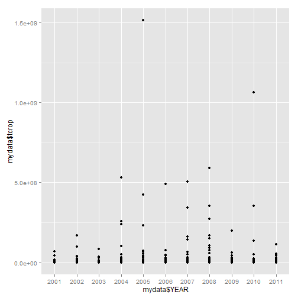
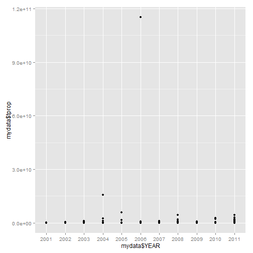

Natural Disasters Impact on Human Lives and the Economy in the United States
========================================================
author: 
date: 
transition: rotate
transition-speed: slow
font-family: 'Helvetica'
First Slide
========================================================

For more details on authoring R presentations click the
**Help** button on the toolbar.

- Bullet 1
- Bullet 2
- Bullet 3


Slide With Code
========================================================
<small style="font-size:.7em">
Maximum total property damge (tprop) is due to a devastating flood from heavy rain in Napa county of North california, happened in 2006, casuing $115B damage.
</small>
<small style="font-size:.5em">

```r
mydata <- readRDS("cleandata.rds")
summary(mydata[,5:6])
```

```
     tcrop              tprop         
 Min.   :0.00e+00   Min.   :0.00e+00  
 1st Qu.:0.00e+00   1st Qu.:1.50e+04  
 Median :0.00e+00   Median :1.78e+05  
 Mean   :3.38e+06   Mean   :5.43e+07  
 3rd Qu.:1.00e+04   3rd Qu.:1.88e+06  
 Max.   :1.51e+09   Max.   :1.15e+11  
```

```r
summary(mydata[,7:8])
```

```
      tfat             tinj       
 Min.   :  0.00   Min.   :   0.0  
 1st Qu.:  0.00   1st Qu.:   0.0  
 Median :  0.00   Median :   0.0  
 Mean   :  0.77   Mean   :   4.8  
 3rd Qu.:  0.00   3rd Qu.:   1.0  
 Max.   :242.00   Max.   :2113.0  
```
</small>

Slide With Plot
========================================================
left:50%
 
***
 
